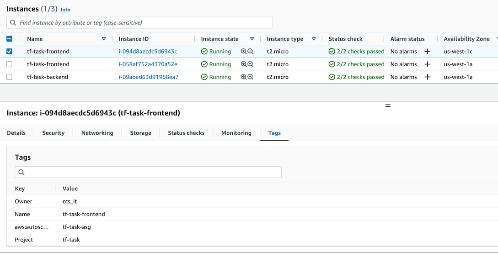

# Terraform Three Tier Infrasture on AWS

[](https://github.com/naeemark/tf-aws-three-tier-infra/actions/workflows/terraform.yml)

Demonstration of requirements understanding, proposing a solution and implementation of _Infrastructure as a Code_ by using the latest tools and techniques.

---

- [What is this repository for](#what-is-this-repository-for)
- [Problem Statement](#problem-statement)
- [Proposed Solution](#proposed-solution)
  - [Deployment Flow](#deployment-flow)
  - [Infrastructure](#infrastructure)
- [Assumptions](#assumptions)
- [Deliverable Content](#deliverable-content)
  - [Directory Structure](#directory-structure)
- [Development Cycle](#development-cycle)
- [Developer Setup](#developer-setup)
- [Configuration](#configuration)
- [Pre-reqs](#pre-reqs)
- [Deployments](#deployment)
- [Contribute](#contribution-guidelines)
- [Screenshots](#screenshots)

---

### What is this repository for

- A terraform project to solve the task for tecAlliance
- Demostrats infrastructure architecture for AWS Cloud
- CI/CD Demonstration using [Github Actions](https://github.com/features/actions)
- The live environment will be established on AWS.

---

### Problem Statement:


---

### Proposed Solution:

- As per the provided instructions, I would like to user terraform for the infrastructure provisioning.
- A custome VPC along with public and private subnests will be created.
- As demanded, a `MySQL` RDS Instance will be prepared for persistence.
- Backend EC2 will be hosted in one of the private subnets.
- The Frontend required multiple instances, so an AutoScalling Group with the provided configs might be a good solution.
- For testing, a bastion host will be provisioned, which will have necessary access to lookup inside the private resources.
- Frontends will be conted to an Application Load Balancer.
- Frontend and Backend instances should include some script for bootstraping / initial configurations.
- Terraform should use necessary features for security and reusability of code.
- A ci/cd pipeline should be inplaced for mocking the whole flow in repository.
- Resources should be used by creating module. (Will keep in same repo)
- The project should be prepared in a way to easily scale for a multi environment deployments with minimal changes.
- ALB endpoint should be shown as an output.

#### Deployment Flow


#### Infrastructure


### Assumptions

- Frontends and Backend wont have any applications to server.
- This task is to demonstrate the infrastructure best practices.
- There wont be a requirements to keep this system up for a long time, instead, some screenshot can be provided.
- Provision of resources to setup a Bastion host will be conditional.
- Procuts associated with an order will belong to same `organisation`
- To avoid circular dependency, an order is not keeping an attribute of `organisation` but will adopt it from one of the associated products
- To have maximum visibility of data attributes, nested object are made enabled for reterieval

### Deliverable Content

#### Directory Structure

```bash
├── .github
│   └── workflows
│       └── terraform.yml
├── .gitignore
├── README.md
├── blueprint
│   ├── backend.tf
│   ├── main.tf
│   ├── modules
│   │   ├── backend
│   │   │   ├── main.tf
│   │   │   ├── outputs.tf
│   │   │   └── variables.tf
│   │   ├── bastion
│   │   │   ├── main.tf
│   │   │   ├── outputs.tf
│   │   │   └── variables.tf
│   │   ├── database
│   │   │   ├── main.tf
│   │   │   ├── outputs.tf
│   │   │   └── variables.tf
│   │   ├── frontend
│   │   │   ├── main.tf
│   │   │   └── variables.tf
│   │   ├── load_balancer
│   │   │   ├── main.tf
│   │   │   ├── outputs.tf
│   │   │   └── variables.tf
│   │   ├── network
│   │   │   ├── main.tf
│   │   │   ├── outputs.tf
│   │   │   └── variables.tf
│   │   └── security_groups
│   │       ├── main.tf
│   │       ├── outputs.tf
│   │       └── variables.tf
│   ├── outputs.tf
│   └── variables.tf
├── envs
│   └── dev
│       ├── main.tf
│       ├── outputs.tf
│       └── variables.tf
└── scripts
    ├── init_backend_server.sh
    ├── init_bastion_host.sh
    └── init_frontend_server.sh
```

### Development Cycle

- Distributes the whole development into Small tasks
- [Each Issue](https://github.com/naeemark/tf-aws-three-tier-infra/issues?q=is%3Aissue) shows a feature
- [Each commit](https://github.com/naeemark/tf-aws-three-tier-infra/commits/main) shows a small progress
- [Pull Requests](https://github.com/naeemark/tf-aws-three-tier-infra/pulls?q=is%3Apr+is%3Aclosed) are done for major tasks

### Developer Setup

To setup the project locally you need to clone this repo, from `main` branch or some latest `TAG`

cd to `envs/dev`

```bash
# cd to `envs/dev` and initialize the project
$ terraform init

#  to Validate
$ terraform validate

# to plan
$ terraform plan

# Apply the changes to aws cloud
$ terraform apply
```

### Configuration

- Terraform should be installed
  ⚠️ AWS Credentials should be setup as defualt profile of local machine

### Pre-reqs

- terrafom
- aws credentials
- VS Code

## Deployment

- When a `pull request` is merged in `main`, `Github Action` starts and following steps are done by automated CI/CD:
  - Makes a deployment to AWS (Mock)

## Contribution guidelines

- Forks are always appreciated

## Screenshots

-  <hr />
-  <hr />
-  <hr />
-  <hr />
-  <hr />
-  <hr />
-  <hr />
-  <hr />
-  <hr />
-  <hr />
-  <hr />
-  <hr />
-  <hr />
-  <hr />
